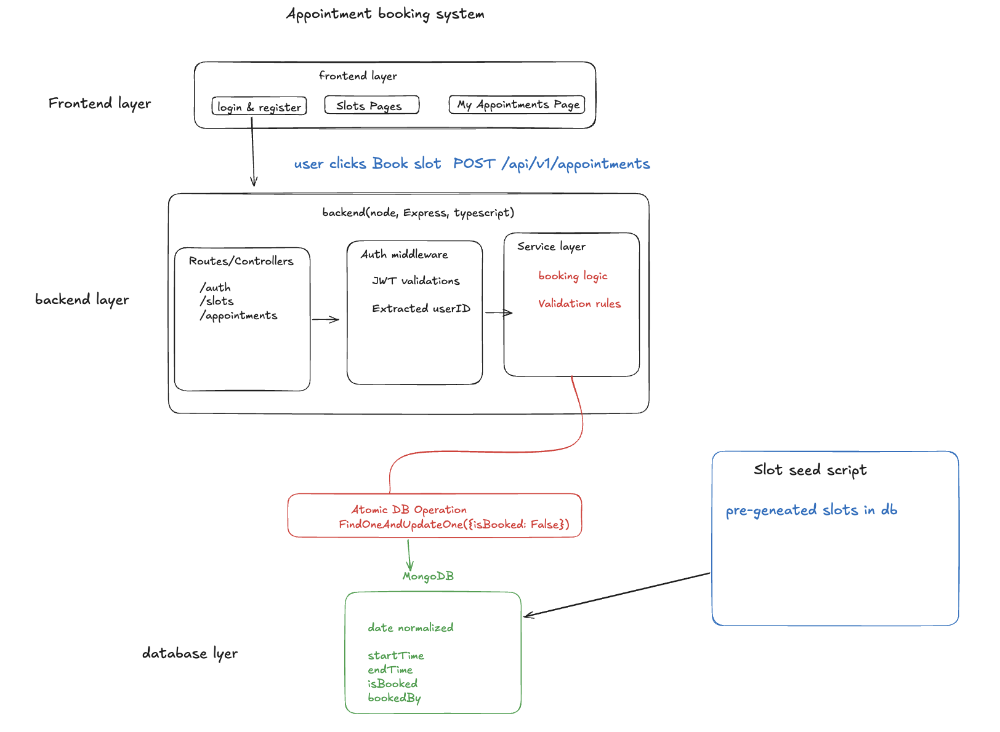

# System Architecture – Appointment Booking System

## 1. Overview

This system is a **fullstack appointment booking application** designed to:

* Allow users to register and login
* View available time slots
* Book one appointment per day
* Cancel appointments within a defined window
* Ensure **concurrency-safe booking**

---



## 2. Tech Stack

### Backend

* **Node.js + Express**
* **TypeScript**
* **MongoDB + Mongoose**
* **JWT Authentication**
* **Argon2 (password hashing)**
* **Zod (validation)**

### Frontend

* **React (Vite + TypeScript)**
* **Tailwind CSS**
* **shadcn/ui**
* **Framer Motion (minimal animations)**

---

## 3. Architecture Style

### Backend Pattern

* **Modular architecture (domain-based)**
* Separation of:

  * Controller → HTTP layer
  * Service → business logic
  * Model → database layer

### Why?

* Improves maintainability
* Easy to scale features
* Clean separation of concerns

---

## 4. Folder Structure (Backend)

```
src/
  modules/
    auth/
    appointment/
    slot/
  
  routes/
    v1/

  middlewares/
  db/
  utils/
  seeders/

  server.ts
```

### Why this structure?

* Groups logic by domain (auth, appointment)
* Keeps shared logic separate (middlewares, utils)
* Scalable for future features

---

## 5. Data Modeling

### Models Used

#### 1. User

```
{
  name: string
  email: string (unique)
  password: string (hashed)
}
```

#### 2. AppointmentSlot (Core Model)

```
{
  date: Date (normalized to start of day)
  startTime: Date
  endTime: Date

  isBooked: boolean
  bookedBy: ObjectId | null
}
```

---

## 6. Key Design Decisions

### 1. No Separate Appointment Model

Instead:

* **Slot itself represents appointment**

#### Why?

* Avoids join complexity
* Enables atomic updates
* Simplifies queries

---

### 2. Pre-generated Slots (Seeder)

Slots are created using a script before runtime.
Use Slot Seeder as primary approach


#### Why?

* Avoid overlap calculations
* Simplifies booking logic
* Enables concurrency-safe updates
### 🧠 Real-World Extension

“In a real system, I would extend this with an admin interface for dynamic slot management”


---

### 3. JWT-based Authentication

* Stateless authentication
* Token contains `userId`

#### Why?

* Simple to implement
* Scalable
* No session storage needed

---

### 4. Password Hashing with Argon2

#### Why Argon2?

* Memory-hard (better security)
* Resistant to GPU attacks
* Modern standard over bcrypt

---

### 5. Validation with Zod

#### Why?

* Centralized validation
* Type-safe input parsing
* Cleaner controllers

---

## 7. Core Business Logic

### Booking Constraints

1. One appointment per day per user
2. No booking past slots
3. No double booking
4. Cancellation allowed only before cutoff

---

## 8. Concurrency Handling (CRITICAL)

### Problem:

Multiple users trying to book same slot

---

### Solution:

Atomic DB operation:

```
findOneAndUpdate(
  { _id: slotId, isBooked: false },
  { isBooked: true, bookedBy: userId }
)
```

---

### Why this works:

* MongoDB ensures atomic update
* Only one user can update `isBooked: false → true`

---

## 9. API Design

### Auth

```
POST /api/v1/auth/register
POST /api/v1/auth/login
```

### Slots

```
GET /api/v1/slots?date=YYYY-MM-DD
```

### Appointments

```
POST   /api/v1/appointments
GET    /api/v1/appointments
DELETE /api/v1/appointments/:id
```

---

## 10. Frontend Architecture

### Pages

* Login
* Register
* Slots (main page)
* My Appointments

### State Management

* Local state (`useState`)
* No global state library (kept simple)

---

### Why?

* Avoid overengineering
* Faster development
* Sufficient for assignment scope

---

## 11. Tradeoffs & Decisions

| Decision             | Benefit       | Tradeoff          |
| -------------------- | ------------- | ----------------- |
| Pre-generated slots  | Simpler logic | Less dynamic      |
| No appointment model | Clean queries | Less flexibility  |
| JWT auth             | Stateless     | No logout control |
| Local state frontend | Simple        | Not scalable      |

---

## 12. Future Improvements

If extended:

* Admin slot management
* Refresh tokens
* Role-based access
* Pagination & filtering
* Notifications (email/SMS)
* Timezone standardization (UTC handling)

---

## 13. Key Engineering Highlights

* Atomic booking (race-condition safe)
* Clean modular backend
* Proper data modeling
* Defensive validation
* Scalable API design

---

## 14. Summary

This system prioritizes:

* **Correctness**
* **Concurrency safety**
* **Simplicity over overengineering**

It is designed to be:

* Easy to understand
* Easy to extend
* Production-aware (within scope)

---
